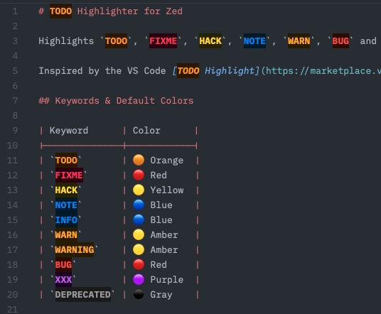

# TODO Highlight for Zed

Highlights `TODO`, `FIXME`, `HACK`, `NOTE`, `WARN`, `BUG` and other keywords across all file types in Zed.



Inspired by the VS Code [TODO Highlight](https://marketplace.visualstudio.com/items?itemName=wayou.vscode-todo-highlight) extension.

## Keywords

`TODO` `FIXME` `HACK` `NOTE` `INFO` `WARN` `WARNING` `BUG` `XXX` `DEPRECATED`

Out of the box, every keyword is highlighted using your theme's `keyword` style — no color configuration required. Per-keyword colors (like the palette in the screenshot above) are an optional override; see [Customizing Colors](#customizing-colors).

## Installation

### 1. Install the extension

Install from the Zed extension registry, or as a dev extension:

1. Build the LSP server binary and add it to your PATH:

   **macOS / Linux**
   ```sh
   cargo build --release -p todo-highlight-lsp
   cp target/release/todo-highlight-lsp ~/.local/bin/
   ```

   **Windows**
   ```powershell
   cargo build --release -p todo-highlight-lsp
   copy target\release\todo-highlight-lsp.exe "$env:USERPROFILE\.local\bin\"
   ```
   (Create `%USERPROFILE%\.local\bin` and add it to your `PATH` if it doesn't exist.)

2. Zed → Extensions → `Install Dev Extension` → select the **`extension/`** subdirectory

### 2. Enable semantic tokens

Open your **global** Zed settings (`⌘,` on macOS, `Ctrl+,` on Linux/Windows) and add a single line:

```settings.json
{
  "semantic_tokens": "combined"
}
```

That's all. Keywords are now highlighted with your theme's `keyword` style in every supported language. No color rules are required.

> **Why is this setting needed?**
> Zed treats semantic-token highlighting as opt-in, and extensions cannot change editor-wide settings on your behalf. Once added, the setting applies to all projects and never needs to be touched again.

## Customizing Colors

By default all keywords share your theme's `keyword` style. To give keywords distinct colors, add override rules to your settings.

The LSP server emits every keyword as the standard `keyword` token type plus a keyword-specific **modifier** — the keyword name in lowercase (`todo`, `fixme`, `hack`, `note`, `info`, `warn`, `warning`, `bug`, `xxx`, `deprecated`). Override rules match on those modifiers, take precedence over Zed's built-in defaults, and only affect this extension's tokens (other language servers don't use these modifiers).

> **Important:** override rules live under `global_lsp_settings`, which Zed only accepts in your **global** `settings.json` (opened with `⌘,`) — not in a project-level `.zed/settings.json`. Zed reports *"Property global_lsp_settings is not allowed"* if you place it there.

Example — a full per-keyword palette with optional dark-theme backgrounds (shown in the screenshot above):

```settings.json
{
  "global_lsp_settings": {
    "semantic_token_rules": [
      { "token_type": "keyword", "token_modifiers": ["todo"],       "foreground_color": "#FF8C00", "background_color": "#2B1700", "font_weight": "bold" },
      { "token_type": "keyword", "token_modifiers": ["fixme"],      "foreground_color": "#FF2D55", "background_color": "#2B0011", "font_weight": "bold" },
      { "token_type": "keyword", "token_modifiers": ["hack"],       "foreground_color": "#FFD60A", "background_color": "#272100", "font_weight": "bold" },
      { "token_type": "keyword", "token_modifiers": ["note"],       "foreground_color": "#0A84FF", "background_color": "#001B2B", "font_weight": "bold" },
      { "token_type": "keyword", "token_modifiers": ["info"],       "foreground_color": "#0A84FF", "background_color": "#001B2B", "font_weight": "bold" },
      { "token_type": "keyword", "token_modifiers": ["warn"],       "foreground_color": "#FF9F0A", "background_color": "#271B00", "font_weight": "bold" },
      { "token_type": "keyword", "token_modifiers": ["warning"],    "foreground_color": "#FF9F0A", "background_color": "#271B00", "font_weight": "bold" },
      { "token_type": "keyword", "token_modifiers": ["bug"],        "foreground_color": "#FF453A", "background_color": "#2B0A00", "font_weight": "bold" },
      { "token_type": "keyword", "token_modifiers": ["xxx"],        "foreground_color": "#BF5AF2", "background_color": "#1B0029", "font_weight": "bold" },
      { "token_type": "keyword", "token_modifiers": ["deprecated"], "foreground_color": "#98989D", "background_color": "#1A1A1A", "font_weight": "bold" }
    ]
  }
}
```

Customize freely: pick any subset of keywords, change any `foreground_color`, or drop fields you don't need.

### Background color

Each rule accepts an optional `background_color` field. The palette above uses colors derived from each keyword's foreground hue at low lightness, tuned for dark themes:

| Keyword | Background |
|---------|-----------|
| `TODO` | `#2B1700` — dark orange |
| `FIXME` | `#2B0011` — dark crimson |
| `HACK` | `#272100` — dark yellow |
| `NOTE` / `INFO` | `#001B2B` — dark blue |
| `WARN` / `WARNING` | `#271B00` — dark amber |
| `BUG` | `#2B0A00` — dark red |
| `XXX` | `#1B0029` — dark purple |
| `DEPRECATED` | `#1A1A1A` — near-black |

**Light themes:** swap the dark backgrounds for light tints — e.g. `#FFF0D9` for TODO, `#FFE5E9` for FIXME.

Omit `background_color` from any rule to leave the editor's default background unchanged for that keyword.

### Migrating from v0.2.x

Earlier versions emitted custom token types (`todoKeyword`, `fixmeKeyword`, …) and required a `semantic_token_rules` block for any highlighting at all. Those token types no longer exist, so old rules silently stop matching — highlighting still works via the default `keyword` style, but your custom colors won't apply until you update each rule:

```diff
-  { "token_type": "todoKeyword", "foreground_color": "#FF8C00", "font_weight": "bold" }
+  { "token_type": "keyword", "token_modifiers": ["todo"], "foreground_color": "#FF8C00", "font_weight": "bold" }
```

If you were happy with the example palette, simply replace your old block with the one in [Customizing Colors](#customizing-colors). If you never got around to configuring rules, you can now delete the requirement from your mental checklist — only `"semantic_tokens": "combined"` is needed.

## Troubleshooting

**Keywords are not highlighted after installation**

1. Confirm `"semantic_tokens": "combined"` is in your **global** `settings.json` (opened with `⌘,`).
2. Confirm the LSP server is running: Zed → `View` → `Toggle Log` → search for `todo-highlight-lsp`.
3. If the log shows "binary not found", the LSP binary is not on your PATH — see step 1 of the installation.

> If you installed the extension without enabling semantic tokens yet, the extension will show a notification after you open two files guiding you to the required setting.

**"Property global_lsp_settings is not allowed"**

You placed color-override rules in a project-level `.zed/settings.json`. Zed only supports `global_lsp_settings` in your **global** settings file — open it with `⌘,` and move the block there.

**Only some keywords are highlighted**

The extension uses word-boundary matching (`\bKEYWORD\b`), so `TODOS` will not match `TODO`. Check for extra characters attached to the keyword.

**Custom colors don't apply**

1. Rules must be in your **global** settings file, not a project-level one (see above).
2. After migrating from v0.2.x, rules must match on `token_modifiers` — `token_type: "todoKeyword"` no longer matches anything (see [Migrating from v0.2.x](#migrating-from-v02x)).
3. Earlier rules take precedence: if another rule above yours also matches (e.g. a bare `"token_type": "keyword"` rule), it wins for the properties it sets.

## Architecture

```
Zed Editor
  └── Extension (Rust → WASM)   — registers LSP server, downloads binary on install
        └── LSP Server (binary) — regex-scans buffers, emits semantic tokens
```

The LSP server is a lightweight Rust binary with no async runtime. It uses INCREMENTAL text sync to minimise data transfer and caches scan results per document version, so repeated token requests for unchanged files return immediately.
